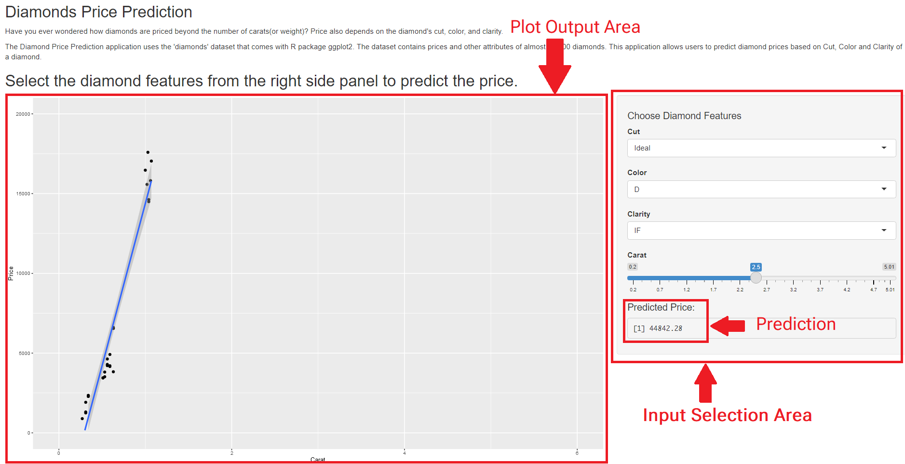

DDP Project: Diamonds Price Prediction
========================================================
author: Tanish Sharma
date: September 25th, 2021
autosize: true

Description
========================================================

The [application](https://google.com) uses the diamond dataset available with R. The dataset contains 8 variables. This application uses the main features only, that is to say, non-redundant features, namely: 
  - Price: Price in US dollars (\$326-\$18,823)
  - Carat: Weight of the diamond (0.2-5.01)
  - Cut: Quality of the cut (Fair, Good, Very Good, Premium, Ideal)
  - Color: Siamond colour, from D (best) to J (worst)
  - Clarity: Measurement of how clear the diamond is (I1 (worst), SI2, SI1, VS2, VS1, VVS2, VVS1, IF (best))

Structure of the dataset
========================================================


```
tibble [53,940 x 10] (S3: tbl_df/tbl/data.frame)
 $ carat  : num [1:53940] 0.23 0.21 0.23 0.29 0.31 0.24 0.24 0.26 0.22 0.23 ...
 $ cut    : Ord.factor w/ 5 levels "Fair"<"Good"<..: 5 4 2 4 2 3 3 3 1 3 ...
 $ color  : Ord.factor w/ 7 levels "D"<"E"<"F"<"G"<..: 2 2 2 6 7 7 6 5 2 5 ...
 $ clarity: Ord.factor w/ 8 levels "I1"<"SI2"<"SI1"<..: 2 3 5 4 2 6 7 3 4 5 ...
 $ depth  : num [1:53940] 61.5 59.8 56.9 62.4 63.3 62.8 62.3 61.9 65.1 59.4 ...
 $ table  : num [1:53940] 55 61 65 58 58 57 57 55 61 61 ...
 $ price  : int [1:53940] 326 326 327 334 335 336 336 337 337 338 ...
 $ x      : num [1:53940] 3.95 3.89 4.05 4.2 4.34 3.94 3.95 4.07 3.87 4 ...
 $ y      : num [1:53940] 3.98 3.84 4.07 4.23 4.35 3.96 3.98 4.11 3.78 4.05 ...
 $ z      : num [1:53940] 2.43 2.31 2.31 2.63 2.75 2.48 2.47 2.53 2.49 2.39 ...
```

User Interface
========================================================



Links
========================================================

  - __Application__: https://0xts.shinyapps.io/Appliication/
  - __Source Code__: https://github.com/0xts/DDP-Project
